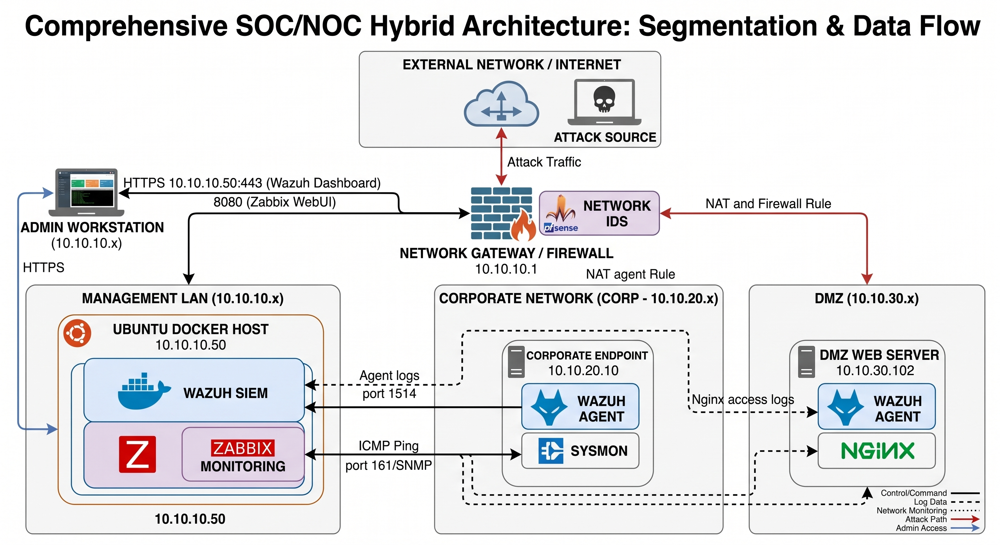

# SOC-NOC-Enterprise-Lab
A hybrid SOC/NOC enterprise lab built with pfSense, Wazuh, and Zabbix for threat detection and infrastructure monitoring.

**A self-built Security Operations Center (SOC) and Network Operations Center (NOC) environment simulating real-world enterprise threat detection and infrastructure monitoring.**

---

## Overview

This project is a fully functional, hybrid **NOC + SOC** lab that reflects how real enterprises monitor both infrastructure health and security posture from a single operations environment. It combines centralized SIEM-based threat detection with performance/uptime monitoring, all running on a segmented network built with enterprise-grade firewall routing.

The lab simulates real attack scenarios — reconnaissance, brute force, privilege escalation, and web application attacks — and validates that the detection stack actually catches them, with incident handling modeled on **NIST SP 800-61 Rev 2** and detections mapped to the **MITRE ATT&CK** framework.

## Architecture

The network is segmented into three zones, connected through a central pfSense firewall/gateway:

| Zone | Subnet | Role |
|---|---|---|
| **Management LAN** | `10.10.10.x` | The "control room" — hosts the Ubuntu Docker server (`10.10.10.50`) running Wazuh (SIEM) and Zabbix (monitoring) |
| **Corporate Network (CORP)** | `10.10.20.x` | Simulated employee workspace — Windows 10 endpoint (`10.10.20.10`) running a Wazuh agent + Sysmon |
| **DMZ** | `10.10.30.x` | Public-facing zone — Ubuntu web server (`10.10.30.102`) running Nginx + Wazuh agent |

Agents installed on the Windows and DMZ endpoints continuously stream logs back to the Management LAN. Zabbix checks system/network health (ICMP, SNMP), while Wazuh analyzes security-relevant events and raises alerts by severity.

## Key Features / What This Demonstrates

- Enterprise-style network segmentation (LAN / CORP / DMZ) with firewall-enforced boundaries
- Centralized SIEM deployment (Wazuh) with endpoint detection & response (EDR) and file integrity monitoring
- Centralized infrastructure monitoring (Zabbix) using both agent-based and agentless (SNMP/ICMP) checks
- Containerized backend deployment using Docker & Docker Compose
- Simulated attacks (reconnaissance, brute force, privilege escalation, web attacks) executed from Kali Linux and mapped to MITRE ATT&CK
- Incident handling workflow aligned with NIST SP 800-61 Rev 2 (identify → contain → eradicate → document)
- Real troubleshooting of SIEM/monitoring integration issues (see [Challenges](#challenges--solutions) below)

## Tools & Technologies

| Tool / Platform | Function | Why It Was Chosen |
|---|---|---|
| **pfSense** | Network routing, segmentation, firewall boundary enforcement | Industry-standard open-source firewall with robust VLAN capabilities |
| **Suricata** | Network-perimeter Intrusion Detection System (IDS) | Deep packet inspection to catch malicious traffic before it reaches endpoints |
| **Wazuh** | SOC platform — log analysis, file integrity monitoring, EDR | Open-source SIEM that maps alerts directly to MITRE ATT&CK |
| **Zabbix** | NOC platform — infrastructure and performance monitoring | Scalable; supports agent-based and agentless (SNMP/ICMP) monitoring |
| **Docker & Compose** | Containerization for Wazuh and Zabbix | Consistent, reliable deployment of complex backend stacks on one host |
| **Sysmon** | Advanced Windows endpoint telemetry | Granular visibility into process creation and network connections |
| **Kali Linux** | Offensive security testing | Used to simulate real-world attacks (SQLi, XSS, privilege escalation) |

## Setup Guide (Condensed)

> Full step-by-step instructions with screenshots are in [`docs/SOC_NOC_Complete_Documentation.docx`](docs/SOC_NOC_Complete_Documentation.docx).

1. **Network Preparation** — Install pfSense; configure three interfaces (LAN, CORP, DMZ); set subnets and firewall rules allowing management traffic from LAN to CORP/DMZ.
2. **Core Server Deployment** — Install Ubuntu Server (`10.10.10.50`) on the LAN; install Docker + Docker Compose; deploy the Wazuh Manager/Indexer stack and Zabbix Server via `docker-compose.yml`.
3. **Endpoint Agent Installation** — Deploy a Windows 10 VM (CORP) and an Ubuntu Server (DMZ); install the Wazuh Agent on both and connect them to the manager; install Sysmon on the Windows VM.
4. **Monitoring Configuration** — In Zabbix, add pfSense and the DMZ server via SNMP templates; add the Windows client via an ICMP Ping template; enable *"File and Printer Sharing (Echo Request – ICMPv4-In)"* on the Windows Firewall so Zabbix pings succeed.

## Simulated Attack Scenarios & Detection

Attacks were launched from a Kali Linux host and validated against Wazuh alerting, with severity-based triage:

- **Medium (Level 7–11):** logged for review
- **High (Level 12–14)** and **Critical (Level 15+):** trigger immediate incident response

| Attack Type | Target | Mapped To |
|---|---|---|
| Reconnaissance / scanning | Network-wide | MITRE ATT&CK — Discovery |
| Brute force | Endpoint auth | MITRE ATT&CK — Credential Access |
| Privilege escalation (sudo) | Linux endpoint | MITRE ATT&CK — Privilege Escalation |
| Web application attacks (SQLi, XSS) | DMZ web server (Nginx) | MITRE ATT&CK — Initial Access |

Incident response followed NIST SP 800-61 Rev 2: identify the source IP → contain (pfSense firewall block) → eradicate the vulnerability → document the incident.

## Challenges & Solutions

| Challenge | Root Cause | Solution |
|---|---|---|
| Wazuh OpenSearch "Internal Server Error" (Null Pointer Exception) | The dashboard's DQL search bar needs exact uppercase boolean operators (`OR`) and precise field matching for nested JSON | Used the built-in "Add Filter" UI tool instead of raw DQL (e.g. filtering `rule.level >= 3`) |
| Missing alerts in Wazuh Dashboard (empty results) | Timezone drift (UTC in container vs. local browser time) + pinned agent filters hiding recent events | Cleared pinned filters, expanded time range to "Last 24 hours," used the raw Discover tab, and verified backend ingestion directly via `alerts.json` |
| Zabbix reporting "Unavailable by ICMP ping" for the Windows 10 client | Windows Defender Firewall blocks incoming ICMP (ping) by default | Enabled the *"File and Printer Sharing (Echo Request – ICMPv4-In)"* firewall rule via PowerShell |

## Lessons Learned

- **Verify at the source:** always check backend log ingestion (e.g. `alerts.json` in Wazuh) before assuming the dashboard UI is broken.
- **Syntax matters:** precise query syntax and field-mapping knowledge prevent dashboard/search errors.
- **Know your defaults:** OS-level firewalls (e.g. Windows blocking ICMP) often silently break standard monitoring protocols.

## Future Roadmap

- [ ] Automated Active Response in Wazuh to auto-block attacking IPs
- [ ] Add a vulnerable web app (e.g. OWASP Juice Shop) in the DMZ for more complex web attack testing
- [ ] Real-time email/Slack alerting for critical Zabbix or Wazuh events

## Full Documentation

Complete documentation — including the executive summary, scope, glossary, and full setup walkthrough — is available in [`docs/SOC_NOC_Complete_Documentation.docx`](docs/SOC_NOC_Complete_Documentation.docx).

## Author

**Lakindu**
Built as a hands-on SOC/NOC training and simulation lab.

---
*This is a personal lab/learning project. Network ranges shown are private (RFC1918) lab addresses, not production infrastructure.*
